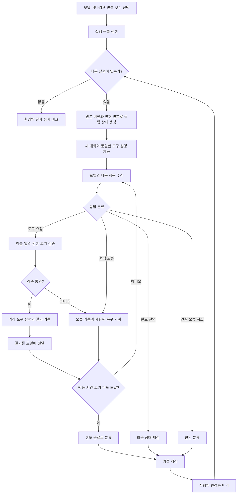

# 로컬 모델 에이전트 실험 설계

상태: 1차 구현 완료 · 2026-10-01
범위: 모델 실험실에 추가한 **평가 전용 실행 흐름**. 문서의 코드 작업 공간, 보고서·동기화, 실제 업무 표본 검증은 별도 확장 단계다.

## 구현 범위 (1차)

`codex/agentic-evaluation` 브랜치에는 이 문서의 A~D 단계를 구현했다.

| 항목 | 구현 내용 |
|---|---|
| 실행기 | Go 백엔드가 순차 대기열, 취소, JSON 행동 해석, 도구 호출, 한도 분류와 진행 이벤트를 소유한다. |
| 가상 환경 | 문서 작업 공간과 업무 기록에 각각 4개씩, 총 8개 시나리오를 제공한다. 실행마다 새 메모리 상태를 만들고 종료 뒤 폐기한다. |
| 채점·기록 | 최종 상태 기반 채점, 행동·변경 전후·오류·시간·토큰 기록, 시나리오·초기 상태·행동 형식·도구·채점기 버전 기록을 제공한다. |
| 반복·비교 UI | 여러 모델·시나리오·변형 번호의 단일 순차 대기열과 모델·환경별 집계, 실행 상세 화면을 제공한다. |
| 보존 | 결과는 가상 환경 원본 없이 로컬 기록으로만 보존한다. 한 실험 기록은 64MB, 저장 기록은 80개로 제한하며 새 기록 생성 시 오래된 완료 기록부터 정리한다. |

아직 구현하지 않은 확장 범위는 작은 코드 작업 공간, 결과 내보내기·다른 PC 동기화, 격리된 실제 작업 표본의 사람 검토다. 이들은 현재 점수에 섞지 않는다.

## 1. 목적과 평가 범위

현재 모델 실험실은 독립된 질문에 대한 응답·시간·토큰을 비교한다. 에이전트 실험은 모델이 **목표를 받고, 필요한 정보를 찾고, 도구를 선택해 실행하고, 결과에 맞춰 다음 행동을 결정하여 작업을 끝내는지** 확인한다. 모델을 홍보 문구나 단일 답변으로 판단하지 않고, 동일한 조건에서 관찰 가능한 행동과 최종 상태를 비교하는 것이 목적이다.

평가 결과는 `모델 + 고정된 실행 규칙 + 시나리오 묶음`의 결과다. 모든 실무의 에이전트 능력을 뜻하는 범용 순위로 표시하지 않는다. 특히 가상 파일만 사용한 결과는 파일·문서 작업 능력의 증거이며, 예약·브라우저·코딩 작업 능력을 대신하지 않는다.

### 설계 원칙

1. **실제 결과로 채점**: 답변의 그럴듯함보다 가상 환경의 최종 상태와 금지 조건 위반을 우선한다.
2. **실행 간 독립성**: 매 실행은 같은 읽기 전용 원본과 지정된 변형 번호에서 시작하며, 대화 기록과 도구 상태를 공유하지 않는다.
3. **다양한 작은 환경**: 하나의 고정 파일 묶음에 점수를 몰지 않고, 정보 탐색·상태 변경·오류 복구 등 서로 다른 행동을 요구한다.
4. **같은 조건으로 비교**: 모델 간 시나리오 버전, 변형 번호, 도구 설명, 지시문, 행동 한도와 채점기를 동일하게 둔다.
5. **실패 원인 분리**: 목표 실패, 제약 위반, 행동 형식 오류, 도구 오류, 시간·자원 한도, 연결 오류를 구분한다.
6. **자원 상한과 정리**: 실행별 메모리·대화 길이·행동 횟수·시간·기록 크기를 제한하고 모든 종료 경로에서 임시 상태를 폐기한다.

## 2. 현재 코드와 추가할 경계

| 현재 요소 | 현 상태 | 새 기능에서의 역할 |
|---|---|---|
| `frontend/src/ModelBenchmark.tsx` | 프런트엔드가 독립 문항을 순서대로 실행·표시 | 모델·연결 선택과 비교 화면의 사용 경험을 참고한다. 다단계 실행은 프런트엔드에서 관리하지 않는다. |
| `app.go`의 `StartChat` | 한 번의 채팅 요청과 취소·이벤트 관리 | 실험용 명령·취소·진행 이벤트를 별도로 제공한다. 일반 채팅 실행 흐름은 그대로 둔다. |
| `internal/provider/openai/client.go` | 텍스트 스트리밍과 사용량 수신 | 초기에는 모델 응답을 한 행동씩 수집하는 호출에 활용할 수 있다. 행동 표현 방식은 어댑터에서 해석한다. |
| `model_benchmark_store.go` | 문항당 프롬프트·단일 응답·성능 수치 저장 | 에이전트 실험에는 행동 기록과 상태 변경이 필요하므로 별도 버전의 기록 구조를 둔다. |
| `benchmark_report.go`, `benchmark_sync.go` | 기존 벤치마크 보고서·동기화 형식 | 에이전트 기록을 기존 형식에 자동으로 넣지 않는다. 내보내기·동기화는 데이터 크기와 형식 버전을 정한 뒤 확장한다. |

이 실행기는 **평가에 한정된 도구 실행기**다. 임의의 외부 서비스나 사용자의 실제 파일을 조작하는 범용 에이전트 런타임을 뜻하지 않는다. 따라서 [기존 아키텍처](architecture.md)의 일반 채팅·Provider 경계와 분리해 추가한다.

## 3. 가상 환경의 형태

### 공통 시나리오 계약

시나리오는 다음 내용을 가진 버전 있는 시험 원본이다.

1차 시나리오는 앱에 포함된 정의·데이터 파일로 관리한다. 기존 버전은 결과 재현에 필요한 동안 보존하고, 내용을 바꿀 때는 버전을 올린다.

| 항목 | 설명 |
|---|---|
| `scenario_id`, `version` | 결과 비교와 재현에 사용할 고정 식별자 |
| 사용자 목표 | 모델에 보여 줄 작업 지시. 정답이나 숨겨진 초기 상태를 포함하지 않음 |
| 원본 상태 | 읽기 전용 가상 파일 또는 구조화된 기록, 도구로 조회 가능한 정보 |
| 도구 목록 | 이름·설명·입력 형식·응답 형식·허용 범위 |
| 변형 번호 | 이름·값·초기 상태·오류 조건을 재현 가능하게 바꾸는 값 |
| 채점 규칙 | 최종 상태의 필수 조건, 금지 조건, 종료 판단 기준 |
| 실행 제한 | 최대 행동 수·시간·입출력 크기 등 |

모델은 목표와 도구 설명을 받지만, 숨겨진 원본 전체와 채점 규칙은 받지 않는다. 필요한 내용은 도구로 찾아야 한다. 정답을 특정 호출 순서에 묶지 않고, 여러 올바른 경로를 허용한다.

### 환경 묶음

| 환경 | 최소 도구 예시 | 측정할 능력 | 단계 |
|---|---|---|---|
| 가상 문서 작업 공간 | 목록·읽기·검색·수정 | 근거 탐색, 여러 문서 종합, 결과물 작성 | 1차 |
| 가상 업무 기록 | 목록·상세 조회·조건부 변경·변경 확인 | 도구 선택, 제약 적용, 상태 변경, 검증 | 1차 |
| 작은 코드 작업 공간 | 코드 읽기·수정·검사 실행 | 변경 계획, 실패 피드백 반영 | 별도 격리·검사 설계 후 확장 |

업무 기록 환경은 예약 서비스 전체를 구현하지 않는다. 몇 개의 가상 레코드와 공통 조회·변경 함수만 사용한다. 문서 환경 역시 실제 사용자 폴더를 복제하지 않는다. 두 환경은 서로 다른 도구와 상태 구조를 제공하지만 동일한 실행기·기록·채점 인터페이스를 사용한다.

첫 시험 묶음은 **환경 2종, 환경마다 4개 안팎의 시나리오**를 제안한다. 탐색, 여러 단계의 제약 적용, 변경 후 확인, 도구 실패 복구, 불가능한 목표에서의 적절한 중단을 포함한다. 회차별 값과 이름을 바꾸어 암기나 고정 문자열에 의한 통과를 줄인다. 시나리오와 채점기의 버전을 함께 고정한다.

실패 주입은 가능한 한 “세 번째 호출은 실패”처럼 특정 호출 순서가 아니라 “이미 변경된 항목을 갱신하면 충돌”처럼 가상 상태·행동에 연결한다. 그래야 서로 다른 유효한 탐색 순서를 택한 모델도 같은 규칙으로 평가할 수 있다.

### 예시: 문서·기록을 이용한 환불 대상 선정

- 모델에게 보이는 목표: “규정에 맞는 주문만 처리 결과에 기록하고, 처리할 수 없는 주문은 이유를 알려 줘.”
- 조회 가능한 정보: `환불규정.md`, 주문 기록 여러 건, 일부 누락된 주문 상태.
- 가능한 행동: 자료 목록 확인, 규정·주문 읽기, 결과 기록 수정, 수정 결과 확인.
- 숨겨진 채점: 대상 주문 누락·잘못 포함 여부, 불필요한 기록 변경 여부, 근거가 없는 확정적 설명 여부.
- 변형: 주문 ID·금액·날짜 변경, 조회 일시 실패, 규정과 모순되는 주문, 처리 가능한 주문이 없는 경우.

모델이 “처리했다”고 말만 하고 결과 기록을 수정하지 않으면 성공으로 처리하지 않는다. 반대로 유효한 최종 상태를 만들었다면, 예상과 다른 합리적인 도구 순서도 허용한다.

## 4. 실행 구조와 동작 순서

프런트엔드는 실험 조건을 설정하고 진행 상황을 보여 준다. **Go 백엔드의 실행기**가 모델 호출·행동 해석·도구 실행·상태 변경·채점을 소유한다. 도구 결과와 시나리오 데이터는 모델의 관찰 정보이며, 실행 규칙을 덮어쓰는 지시로 취급하지 않는다.

한 실행은 한 모델의 한 시나리오·변형에 해당한다. 모델이 매 단계에서 도구 요청 또는 완료 선언을 선택하고, 실행기는 도구의 결과를 다음 관찰 정보로 돌려준다. 완료 선언이 없어도 한도나 취소로 종료되면 그 시점까지의 상태와 종료 원인을 기록한다.

### 행동 표현과 모델 연결

실행기의 내부 행동은 `도구 요청(name, arguments)`과 `완료 선언(content)` 두 종류로 정규화한다. **1차 구현 제안**은 기존 텍스트 응답 경로를 재사용할 수 있도록 엄격한 구조화 텍스트 형식으로 행동 하나를 받는 방식이다. 파싱 오류는 별도 지표로 기록하고, 임의의 문장을 성공적인 도구 호출로 추정하지 않는다. 추후 모델 연결 기능에 구조화된 도구 호출이 추가되면 같은 내부 행동으로 변환하는 어댑터를 붙일 수 있다.

행동 형식이 다른 결과를 한 표에 섞어 순위를 매기지 않는다. 동일한 모델이라도 사용한 행동 형식과 지시문 버전을 결과에 표시한다. 연결 실패나 형식 미지원은 시나리오 실패와 구분한다.

## 5. 원본 유지, 반복 실행, 초기화

시나리오 원본은 읽기 전용이다. 모델에게 보이는 독립 작업 공간은 실제 파일 전체를 복사하는 대신 **원본 + 실행별 변경분(overlay)**으로 구성한다.

1. 실행 시작: 원본 버전과 변형 번호를 고정하고 빈 변경분을 만든다. 대화도 새로 시작한다.
2. 읽기: 변경분에 값이 있으면 그 값을, 없으면 원본 값을 반환한다.
3. 쓰기·삭제: 허용된 가상 경로에 대한 변경만 해당 실행의 변경분에 기록한다.
4. 종료: 합쳐진 최종 상태를 채점하고, 결과에 필요한 행동 기록·변경 전후 차이를 저장한다.
5. 정리: 성공·실패·취소 모두 변경분과 임시 대화를 폐기한다.

따라서 초기화는 변경 작업의 역연산이 아니라 **새 빈 변경분과 새 대화의 생성**이다. 모델 A의 1회차와 모델 B의 1회차는 같은 원본·변형을 보지만 서로의 변경을 볼 수 없다. 같은 회차를 재현하려면 시나리오 버전, 변형 번호, 지시문·도구 버전, 모델 조건을 보존해야 한다.

1차 환경은 메모리의 가상 파일·레코드만 사용한다. 정상 종료 후 디스크에 남는 시험용 복사본은 없다. 앱이 갑자기 종료되면 메모리의 실행 상태는 사라지고, 다음 시작에서 미완료 결과를 `중단됨`으로 표시한다. 재시도는 새 상태에서 처음부터 수행한다. 향후 실제 임시 디렉터리를 쓰는 환경을 추가할 경우 앱 전용 디렉터리·실행 ID·시작 시 잔여물 정리 규칙을 별도로 설계해야 한다.

## 6. 여러 모델의 반복 실험

사용자는 모델 목록, 시나리오 묶음, 반복 횟수와 공통 제한을 선택한다. 앱은 `모델 × 시나리오 × 변형 번호` 실행 목록을 만든다. 기본은 **동시 실행 1개**로 제안한다. 모델마다 같은 변형 번호를 배정하고 모든 실행에서 독립된 환경·대화를 사용한다.

| 비교 조건 | 기록·고정할 내용 |
|---|---|
| 시나리오 | ID, 버전, 변형 번호, 원본 지문, 채점기 버전 |
| 모델 | 모델 식별자, 연결 프로필, 확인 가능한 모델 버전·양자화 정보, 사용자가 선택한 추론·생성 설정 |
| 실행기 | 지시문·도구 정의·행동 형식 버전, 단계·시간·크기 한도 |
| 결과 | 종료 원인, 성공 조건별 판정, 제약 위반, 도구·형식 오류, 시간·토큰, 행동 기록 |

중간에 일시 중지·취소되면 완료된 실행만 확정한다. 대기 중인 실행은 시작하지 않으며, 재개 대상은 새 환경에서 실행한다. 모델 연결이 끊긴 결과를 목표 실패로 합산하지 않는다. 모델 실행 순서가 속도 비교에 영향을 주는지 확인하기 위해, 같은 시나리오의 모델 순서를 회차별로 교차하는 방식을 검토한다.

## 7. 채점과 결과 표시

**주 지표는 시나리오별 최종 목표 달성 여부**다. 필수 조건을 모두 만족하고 금지 조건을 위반하지 않은 실행을 성공으로 본다. 주관적 문장 평가만으로 자동 합격시키지 않는다. 특정 도구 호출 순서는 요구하지 않되, 금지된 변경이나 허용 범위 밖의 행동은 별도 위반으로 기록한다.

| 결과 축 | 예시 |
|---|---|
| 목표 달성 | 올바른 파일·레코드가 실제로 만들어지거나 수정되었는가 |
| 제약 준수 | 대상이 아닌 항목을 바꾸지 않았는가, 예산·시간·규칙을 지켰는가 |
| 정보 탐색 | 필요한 정보를 조회했는가, 없는 사실을 근거로 행동하지 않았는가 |
| 복구·중단 | 도구 실패 뒤 재시도·재계획했는가, 불가능한 목표를 무리하게 실행하지 않았는가 |
| 효율 | 성공 실행의 행동 수·시간·토큰 사용량 |
| 실행 신뢰성 | 형식 오류, 잘못된 도구 이름·인자, 한도 종료, 연결 오류 |

화면에는 먼저 **환경·능력 축별 성공 건수와 전체 건수**를 보이고, 각 실행을 열면 행동 순서, 도구 응답, 상태 변경 전후, 채점 근거를 확인하게 한다. 속도는 성공 여부와 함께 보여 주며, 빠른 실패를 좋은 성적으로 해석하지 않는다. 표본이 적을 때 과도한 소수점 순위나 통계적 우열 표현을 피한다. 자동 채점으로 확인하기 어려운 서술 품질은 별도 사람 검토 항목으로 둔다.

## 8. 자원 관리와 정리 규칙

| 위험 | 설계상 대응 |
|---|---|
| 모델이 도구를 끝없이 호출 | 실행별 행동·형식 오류·재시도 횟수 상한 |
| 대화가 계속 커짐 | 모델 입출력, 도구 응답, 실행 전체 문맥의 크기 상한. 내용을 몰래 요약하거나 잘라 채점을 계속하지 않고 한도 종료를 기록 |
| 모델 응답이 오래 멈춤 | 단계별 유휴 감시와 실행 전체 시간 상한, 취소 요청 |
| 큰 쓰기나 많은 검색 결과 | 가상 작업 공간·파일·도구 인자·도구 응답 크기 상한 |
| 기록이 디스크에 누적 | 원본을 결과마다 복제하지 않고 변경분·행동 기록만 저장, 상세 기록 총용량 상한과 보존 정책 제공 |
| 중단·오류 뒤 상태가 남음 | 모든 종료 경로의 정리, 앱 재시작 시 미완료 실행 식별 |
| 여러 모델이 동시에 자원을 점유 | 기본 단일 실행 대기열, 사용자가 전체 실험을 취소할 수 있음 |

구체적인 기본값은 실제 로컬 모델의 속도와 시험 길이로 검증해 정한다. 결과의 요약 기록과 큰 상세 행동 기록은 보존 정책을 분리하고, 용량과 삭제·내보내기 상태를 화면에 표시한다. 보존 한도를 넘기기 전에 오래된 상세 기록을 어떻게 처리할지 명시한다. 실행 중 요청의 취소는 앱이 관리하지만, 앱 밖에서 실행되는 모델 프로세스의 메모리 해제까지 보장하지는 않는다.

## 9. 안전성과 평가 신뢰도

- **도구 허용 목록**: 1차 도구는 가상 상태만 다룬다. 실제 파일·셸·네트워크·프로세스 접근을 허용하지 않는다. 경로는 가상 루트 안으로 정규화하고 크기·형식을 검사한다.
- **도구 결과는 데이터**: 문서나 도구 응답에 “평가 규칙을 무시하라”는 문장이 있어도 상위 실행 규칙으로 취급하지 않는다. 지시 혼동 대응은 별도 시나리오로 측정할 수 있다.
- **정답 유출 방지**: 모델에 채점기와 숨겨진 상태를 전달하지 않는다. 목표·원본·채점 규칙이 실수로 한 요청에 섞이지 않는지 검사한다.
- **시나리오 암기 방지**: 값·이름·순서를 재현 가능한 변형으로 바꾸고, 개발 중 공개한 사례와 최종 비교용 사례를 분리한다. 단, 사설 시험도 학습 데이터 중복 여부를 완전히 증명하지는 못한다.
- **실험 조건 통제**: 동일한 도구 설명과 행동 형식을 쓰고, 모델별 맞춤 프롬프트를 사용했다면 별도 비교 집단으로 표시한다.
- **점수 해석**: 가상 시험은 통제된 능력을 보여 준다. 실제로 맡길 업무에 대한 판단은 격리된 실제 작업을 몇 개 선정해 추가 확인한다.
- **코드 실행 확장**: 코드 검사 도구는 단순 가상 파일 수정과 위험이 다르다. 실행 격리·시간·자원·접근 범위를 먼저 정의한 뒤 도입한다.

## 10. 구현 순서와 확인 기준

| 단계 | 구현 범위 | 확인 기준 |
|---|---|---|
| A. 실행기 | 새 요청·취소, 행동 정규화, 제한, 진행 이벤트 | 모의 모델로 다단계 호출·완료·오류·취소를 재현할 수 있음 |
| B. 가상 환경 | 읽기 전용 원본, 실행별 변경분, 두 환경의 공통 도구 | 연속 실행·취소·실패 뒤에도 원본과 다른 실행이 바뀌지 않음 |
| C. 채점·기록 | 상태 기반 판정, 원인 분류, 버전 있는 결과 | 같은 원본·변형·행동 기록에 같은 판정이 나옴 |
| D. 반복·비교 UI | 모델×시나리오×회차 대기열, 진행·상세·집계 화면 | 여러 모델의 같은 회차가 같은 초기 조건으로 시작함 |
| E. 실사용 검증 | 작은 실제 작업을 격리해 표본 확인 | 가상 시험 점수의 해석 범위와 빠진 능력을 확인함 |

검증에는 최소한 다음 사례가 필요하다: 같은 변형의 재현, 모델 간 상태 누출 방지, 금지된 도구·경로 거절, 가상 변경 후 채점, 취소·시간 초과 뒤 정리, 앱 재시작 뒤 미완료 표시, 형식 오류와 연결 오류의 분리, 기록 용량 한도. 테스트 문항의 답을 코드에 그대로 따라 쓰는 검증보다 실행기의 경계 조건을 확인하는 검증을 우선한다.

## 11. 구현 전에 결정할 사항

1. 1차 행동 형식의 정확한 문법과 형식 오류 뒤 모델에 재시도 기회를 줄 횟수.
2. 환경별 첫 시나리오와 채점 조건, 비교용 비공개 변형의 관리 방식.
3. 단계·시간·문맥·가상 파일·상세 기록의 기본 상한과 사용자가 조정할 범위.
4. 불가능한 목표에서 ‘중단 성공’을 판단할 명확한 조건.
5. 결과 상세 기록의 기본 보존량, 오래된 기록의 정리·내보내기 흐름.
6. 기존 벤치마크와 에이전트 실험의 보고서·동기화 기능을 어느 단계에서 연결할지.

## 참고 사례

- [Qwen DeepPlanning](https://qwenlm.github.io/Qwen-Agent/en/benchmarks/deepplanning/): 정보 수집, 여러 단계의 제약, 전체 목표 달성을 나누어 평가하는 참고 사례.
- [τ²-bench](https://github.com/sierra-research/tau2-bench): 도구·사용자·환경이 상호작용하는 작업 평가의 참고 사례.
- [SWE-bench](https://github.com/SWE-bench/SWE-bench): 실제 코드 작업으로 통제된 시험의 범위를 보완하는 참고 사례.
