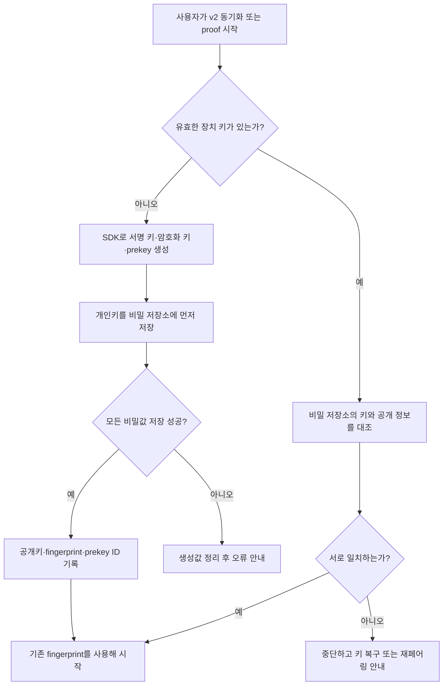
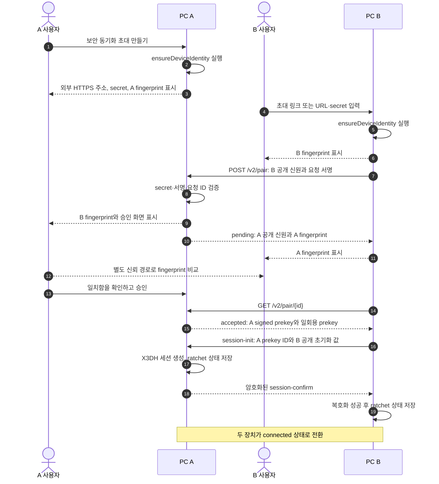
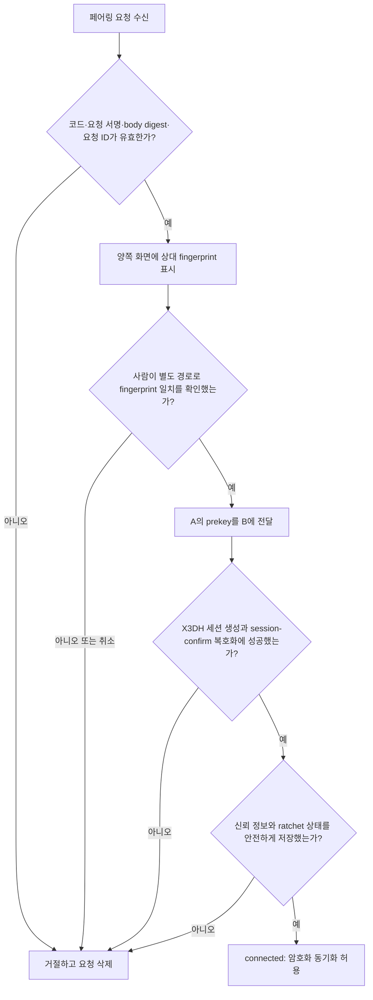
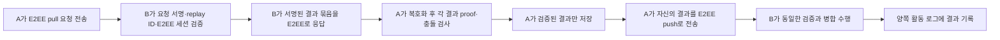

# ANP Go SDK 기반 벤치마크 동기화 설계안

> 상태: **v2 기반 구현 진행 중** — `main`의 v1 LAN 전송·일회용 코드·Bearer 토큰 코드와 UI는 제거했고, 태그 `benchmark-sync-v1`에 보관한다. `main`에는 ANP Go SDK `v1.0.3`, 운영체제 비밀 저장소 기반의 Ed25519/X25519 장치 키, 변조를 거절하는 서명 envelope, 결과 proof 영속화, 앱이 인증서 PEM·개인키 PEM을 직접 읽는 TLS 1.3 endpoint, 그리고 서명된 128비트 초대 secret·양쪽 fingerprint 승인 페어링이 있다. E2EE 전송과 실제 pull/push는 아직 구현하지 않았다.

## 1. 목적과 결정

태그 `benchmark-sync-v1`은 기존 LAN 전용 v1 구현을 보존한다. `main`에서 개발할 v2는 한 장치가 외부에서 접근 가능한 HTTPS 주소를 제공하고, 다른 장치가 그 주소로 직접 연결하는 **검증 가능한 1:1 벤치마크 동기화**다. 새 설계가 해결할 문제는 다음과 같다.

1. IP 주소, 장치 이름, Bearer 토큰이 아니라 암호 키로 상대 장치를 식별한다.
2. 벤치마크 결과 자체에 원본 장치의 서명을 남긴다. 결과가 보고서나 다른 PC를 거쳐도 출처와 변조 여부를 확인할 수 있어야 한다.
3. 신뢰한 두 장치 사이에서 동기화 본문을 종단 간 암호화한다.
4. 기존 기록은 읽을 수 있게 유지하되, v2는 LAN에 한정하지 않는다. 사용자의 명시적 페어링 승인과 보안 감사 로그를 남긴다.
5. 네트워크 자동 탐색, 공개 인터넷 검색, 릴레이 서버, 그룹 동기화는 이 단계의 범위가 아니다.

초기 구현은 완전한 `did:wba` 상호운용을 전제하지 않는다. 외부 HTTPS 수신 장치는 안정적인 도메인과 TLS 인증서를 가져야 하지만, 장치 신원 자체는 **로컬에서 생성한 키와 사람이 확인한 fingerprint**를 기본으로 한다. 향후 조직 계정·DID 문서 발행이 필요해지면 같은 키를 DID 문서에 연결한다.

### 현재 구현 위치

| 항목 | 상태 | 비고 |
|---|---|---|
| v1 보존 | 완료 | 로컬 태그 `benchmark-sync-v1`에 보존한다. `main`에는 v1 실행 경로와 화면이 없다. |
| ANP 키와 장치 신원 | 완료 | Ed25519 서명 키와 X25519 키 합의 키를 첫 v2 사용 시 생성한다. 개인키는 OS 비밀 저장소에만 둔다. |
| 서명 envelope | 기반 완료 | 본문 digest·발신 키 ID·시각·nonce를 ANP Ed25519 키로 서명하고, 본문·서명·키 ID 변경과 만료 메시지를 거절하는 테스트를 둔다. |
| v2 결과 proof 영속화 | 기반 완료 | 완료된 로컬 결과에 공개키·원본 ID·digest·서명을 붙여 파일에 저장한다. 로컬 편집은 기존 proof를 지우며, v2 전송 단계가 proof 생성·상대 공개키 검증을 호출한다. |
| v2 UI·공개 설정·감사 로그 | 완료 | 장치 이름, 공개 fingerprint, 외부 HTTPS 도메인·인증서 PEM·개인키 PEM 경로·수신 주소와 최근 200건의 로컬 감사 로그를 제공한다. |
| 직접 TLS 수신 endpoint | 완료 | 앱이 인증서 도메인·개인키 일치를 확인한 뒤 TLS 1.3 listener를 직접 열고, 시작·중지와 앱 재시작을 처리한다. 현재는 상태 확인만 제공한다. |
| v2 초대·페어링 | 완료 | 128비트 secret, 요청·응답 서명, 만료, 한 번 사용, 양쪽 fingerprint 확인과 신뢰 공개키 저장을 제공한다. secret은 메모리에만 둔다. |
| E2EE·전송 | 미구현 | 다음 단계에서 prekey, 직접 E2EE 세션, 암호화 pull/push를 연결한다. |

## 2. 채택할 SDK 범위

Go 모듈은 다음처럼 명시적으로 고정한다. 구현 시작 직전에 최신 태그와 호환성은 다시 확인하되, 문서 작성 시점의 기준 버전은 `v1.0.3`이다.

```text
github.com/agent-network-protocol/anp/golang v1.0.3
```

v2에서 사용하는 SDK 기능과 용도는 다음과 같다.

| SDK 기능 | v2에서의 역할 | 이번 범위 |
|---|---|---|
| 키 재료 및 Ed25519 서명 | 장치 서명 키 생성, 결과·요청 서명, 공개키 검증 | 사용 |
| DID/WBA 문서·HTTP Message Signature | 장치 키 식별과 HTTP 요청 출처 검증 | 사용. DID 문서 공개는 선택 |
| Data Integrity / object proof 보조 기능 | 결과 증명 포맷 검증 | 사용 검토. 앱 전용 서명 envelope를 우선 확정 |
| Direct E2EE: prekey, X3DH, ratchet | 페어링 뒤 JSON 본문 암호화 | 사용 |
| WNS | 사람이 읽는 전역 이름 | 사용하지 않음 |
| Agent Description / Discovery / OpenRPC 자동 생성 | 공개 에이전트 API 및 발견 | 사용하지 않음 |
| Group E2EE / MLS | 다수 장치 그룹 동기화 | 사용하지 않음 |
| AP2, 메타 프로토콜 | 결제·동적 프로토콜 협상 | 사용하지 않음 |

Go SDK는 키 생성, DID/WBA, HTTP Message Signature, 증명, WNS, 직접 E2EE를 제공한다. 반면 Python의 OpenANP처럼 Agent Description·RPC 서버를 자동으로 만드는 Go 서버 프레임워크로 가정하지 않는다. 이 앱의 HTTP 경로와 JSON 모델은 Go 코드에서 직접 유지한다.

## 3. 목표 아키텍처

```text
┌───────────────── PC A ─────────────────┐       ┌───────────────── PC B ─────────────────┐
│ OS 키체인                               │       │ OS 키체인                               │
│  ├─ 장치 서명 개인키 (Ed25519)          │       │  ├─ 장치 서명 개인키 (Ed25519)          │
│  └─ E2EE 개인키·ratchet 상태            │       │  └─ E2EE 개인키·ratchet 상태            │
│                                         │       │                                         │
│ benchmarkSyncService                    │       │ benchmarkSyncService                    │
│  ├─ 신원·신뢰 저장소                    │       │  ├─ 신원·신뢰 저장소                    │
│  ├─ 서명된 결과 생성/검증               │       │  ├─ 서명된 결과 생성/검증               │
│  └─ E2EE envelope 생성/해제             │       │  └─ E2EE envelope 생성/해제             │
│             │ 외부 HTTPS + 요청 서명      │       │             ▲ 외부 HTTPS + 요청 서명      │
│             └── 암호화된 JSON ───────────┼───────┘                                     │
└─────────────────────────────────────────┘       └─────────────────────────────────────────┘
```

TLS는 전송 중인 메타데이터와 페어링 요청을 보호한다. 직접 E2EE는 TLS 종단이나 프록시가 평문 결과를 보지 못하게 한다. 둘 중 하나만으로 다른 하나를 대체하지 않는다.

## 4. 보안 모델과 저장소

### 4.1 장치 키는 언제, 무엇을, 어떻게 만드는가

**키는 앱을 설치하거나 실행할 때마다 만들지 않는다.** 사용자가 처음으로 v2 **결과 동기화** 작업 공간을 열거나 결과 proof 생성을 시작하면 `LoadOrCreate()`가 기존 키를 확인하고, 없을 때만 기본 장치 키 묶음을 한 번 생성한다. 따라서 앱을 재시작하거나 동기화를 반복해도 fingerprint는 바뀌지 않는다.



처음 생성하는 값과 이유는 다음과 같다. 이름이 비슷해도 서로 다른 용도이므로 한 키를 다른 용도로 재사용하지 않는다.

| 생성 시점 | 값 | 생성 방법 | 절대 보내지 않는 값 | 상대에게 보내는 값 |
|---|---|---|---|---|
| 첫 보안 동기화 시작, 장치당 1회 | **서명 키 쌍** | ANP Go SDK로 Ed25519 키 쌍 생성 | 서명 개인키 | 서명 공개키, `keyID`, fingerprint |
| 첫 보안 동기화 시작, 장치당 1회 | **암호화 신원 키 쌍** | SDK의 X25519 키 재료 생성 | 암호화 신원 개인키 | 암호화 신원 공개키 |
| 페어링 단계 구현 때 | **서명된 prekey** | 새 X25519 키 쌍을 만들고, 그 공개키에 서명 키로 서명 | prekey 개인키 | prekey ID, 공개키, 서명 |
| 페어링 단계 구현 때 및 부족할 때 보충 | **일회용 prekey 묶음** | X25519 키 쌍을 20개 생성 | 각 개인키 | 아직 쓰이지 않은 공개키 하나의 ID와 공개키 |
| 두 장치가 페어링을 확정할 때마다 | **E2EE 세션/ratchet 상태** | 양쪽 공개키와 prekey로 X3DH 세션을 만들고 ratchet 시작 | 세션 비밀값, ratchet 키 | 세션 ID와 공개 초기화 메시지 |

`prekey`는 “상대가 내 암호화 세션을 시작할 때만 쓰도록 미리 준비해 둔 공개키”라고 생각하면 된다. 상대는 공개키만 받아 암호문을 만들 수 있고, 이 장치만 보관한 개인키가 있어야 같은 세션을 열 수 있다. 일회용 prekey는 성공한 첫 세션에 한 번만 쓰고 폐기한다.

구현 시 SDK의 키 생성 함수를 사용해 운영체제의 암호학적 난수원으로 키를 만든다. 개발자가 시간·장치 ID·임의 문자열로 키를 만들거나, `math/rand`를 사용해서는 안 된다. 이 문서는 개념과 데이터 수명을 정하고, 실제 SDK 타입과 함수 호출은 추가할 SDK 버전의 API 문서에 맞춰 구현한다.

#### 저장 순서와 실패 처리

키를 만들었는데 저장을 실패하면 새 fingerprint가 화면에 노출되면 안 된다. 다음 순서를 지킨다.

1. 서명 개인키, 암호화 개인키, prekey 개인키를 OS 키체인/비밀 저장소에 저장한다.
2. 모두 성공했는지 다시 읽어 확인한다.
3. 그 다음에만 공개키, fingerprint, prekey ID를 `benchmark-sync-v2.json`에 기록한다.
4. 어느 단계든 실패하면 보안 동기화를 시작하지 않고, 방금 만든 비밀값을 삭제하거나 미완료 상태로 표시해 다음 시작 때 안전하게 정리한다.

장치 개인키, prekey 비밀값, ratchet 상태는 `benchmark-sync-v2.json` 같은 일반 JSON 설정 파일에 평문 저장하지 않는다. 앱의 설정 폴더 권한은 보조 방어일 뿐, 키 보관소를 대체하지 않는다. TLS 개인키는 사용자가 선택한 PEM 파일에서 앱이 직접 읽으며, 설정 파일에는 그 경로만 저장한다.

공개 정보는 다음처럼 구분한다.

```text
deviceID    = 서명 공개키의 안정적인 digest에서 만든 앱 내부 ID
keyID       = 현재 서명 공개키를 식별하는 값
fingerprint = 사람이 비교하는 짧고 그룹화된 keyID 표시값
did         = 선택. 공개 DID 문서를 실제로 제공할 수 있을 때만 사용
```

`deviceID`와 fingerprint는 공개해도 되지만, 둘로 서명하거나 복호화할 수는 없다. 장치 이름은 표시용이며 보안 판단에는 사용하지 않는다.

#### 키 교체와 분실

- **서명 키 또는 암호화 신원 키가 사라지거나 손상된 경우**: 새 키 묶음을 만들고 새 fingerprint를 부여한다. 이미 연결한 모든 장치는 키 변경 경고를 표시하고 재페어링해야 한다.
- **서명된 기존 결과**: 새 키로 다시 서명하지 않는다. 이전 공개키를 함께 보관하는 장치는 예전 proof를 계속 검증할 수 있다.
- **서명된 prekey**: 만료 전에 새로 만들고, 새 prekey의 공개 부분을 다음 capability/페어링 응답에 실어 보낸다. 이미 만들어진 세션은 prekey 교체만으로 끊지 않는다.
- **일회용 prekey**: 수량이 5개 아래로 내려가면 20개가 되도록 보충한다. 사용한 prekey의 개인값은 세션 상태를 안전하게 저장한 뒤 폐기한다.

### 4.2 사람이 확인하는 신뢰 관계

v2 초기 페어링은 v1 절차를 이어받지 않는다. 초대를 만드는 장치가 **외부 HTTPS 주소 + 128비트 이상의 일회용 `pairingSecret` + 자신의 fingerprint**를 만들고, 연결하는 장치가 이를 입력해 요청한다. secret은 임시 초대장일 뿐이며, 실제 신뢰 관계는 양쪽 사용자가 **fingerprint를 비교**해 승인할 때만 만들어진다.

승인 화면에는 다음을 한 화면에 표시한다.

- 상대 장치 이름과 접속 주소
- 상대 서명 키 fingerprint (예: `FJ7K-2P9M-…`)
- 상대가 지원하는 `benchmark-sync/v2`와 E2EE 여부
- “다른 안전한 방법으로 두 화면의 fingerprint가 같은지 확인한 뒤 승인하세요”라는 안내

승인하면 상대의 `deviceID`, `keyID`, 서명 공개키, 암호화 신원 공개키, 서명된 prekey, 처음 확인한 fingerprint와 신뢰 시각을 저장한다. 이후 같은 `deviceID`가 다른 서명 키를 제시하면 동기화를 중단하고 **키 변경 재승인**을 요구한다. 주소 변경은 허용하지만 키 변경은 자동 허용하지 않는다.

### 4.3 외부 HTTPS 수신 장치의 요구사항

v2에서 A는 B가 접속할 수 있는 안정적인 HTTPS 주소를 제공한다. 예를 들면 `https://sync.example.com`처럼 **도메인 이름과 공개 CA(또는 조직 CA) 인증서**가 있어야 한다. 앱은 지정한 인증서의 도메인과 개인키 일치를 확인하고 TLS를 직접 종료하며, B는 표준 TLS 검증으로 신뢰하지 않는 자체 서명 인증서를 거절한다.

| 항목 | A: 외부 HTTPS 수신 장치 | B: 연결 장치 |
|---|---|---|
| 네트워크 | 앱이 직접 연 TLS 수신 포트에 라우터·방화벽이 도달할 수 있어야 함 | 일반적인 HTTPS 아웃바운드 연결만 필요 |
| 주소 | DNS 이름이 인증서 SAN과 일치 | 초대에서 받은 `https://` URL만 사용 |
| TLS | 앱이 인증서 PEM·개인키 PEM을 직접 읽고 TLS 1.3으로 수신 | 호스트 이름·인증서 체인을 표준 TLS 검증 |
| 장치 신원 | HTTP 요청과 응답을 장치 서명 키로 서명 | 인증서와 별도로 A fingerprint를 사람 확인 |

인증서 갱신은 일상적인 운영 작업이므로 TLS leaf certificate를 고정하지 않는다. 대신 **장치 서명 공개키를 고정**한다. 인증서는 전송 경로와 도메인을 검증하고, fingerprint와 HTTP Message Signature는 “이 요청을 보낸 장치가 전에 승인한 장치인가”를 검증한다.

원격 공개 주소는 스캔·추측 요청을 받을 수 있다. 따라서 v2는 다음을 반드시 적용한다.

1. `http://`를 거부하고 HTTPS만 수신한다.
2. v1의 짧은 표시 코드 대신 128비트 이상인 일회용 `pairingSecret`을 생성해 초대 링크 또는 QR로 전달한다. 만료 전까지 한 번만 쓴다.
3. `/pair` 이외의 경로는 신뢰한 장치의 요청 서명 없이는 정보를 주지 않는다.
4. IP별 rate limit, 요청 body 크기 제한, 만료된 페어링 요청 정리, 최소한의 오류 메시지를 적용한다.
5. 공개 Discovery 목록·장치 목록·벤치마크 목록을 제공하지 않는다.

두 장치가 모두 외부에서 수신할 수 없다면 이 설계만으로는 직접 연결할 수 없다. 그 경우는 VPN 또는 별도의 암호문 릴레이 서버를 도입하는 다음 단계의 문제이며, v2 초기 범위에 넣지 않는다.

### 4.4 위협별 대응

| 위협 | 이전 방식의 한계 | v2 대응 |
|---|---|---|
| 인터넷에서의 초대 추측·스캔 | 짧은 코드와 LAN 내부만 가정 | 128비트 일회용 secret, rate limit, 비공개 경로 |
| 결과 내용 변조 | 전송 후에는 원본 출처 확인 불가 | 원본 결과 서명 검증 |
| HTTPS 종단/프록시의 평문 접근 | HTTP 서버는 평문 | TLS와 직접 E2EE envelope |
| 주소 재사용 또는 이름 위조 | 이름·IP로는 동일 장치 판별 불가 | 공개키 fingerprint 고정 |
| 암호문 재전송 | 토큰 기반 요청은 별도 replay 모델 없음 | ratchet 메시지 번호, nonce, 만료 시각, idempotency ID |
| 오래된 키 탈취 | 신뢰 철회 절차 없음 | 장치 해제, 키 변경 경고, 새 페어링 |

이 설계는 손상된 장치 자체, 화면을 보면서 승인하는 공격자, 사용자가 잘못된 fingerprint를 승인하는 상황까지 해결하지는 않는다.

### 4.5 사용자 화면과 보안 감사 로그

연결과 동기화의 암호 절차를 일반 사용자 화면에 그대로 보여 주지 않는다. 화면에는 `연결됨`, `마지막 동기화`, `검증된 결과 수`, `조치 필요` 정도의 요약만 표시한다. 세부 과정은 로컬의 구조화된 보안 감사 로그로 남겨, 연결 오류·키 변경·결과 검증 실패를 나중에 확인할 수 있게 한다.

| 기록할 이벤트 | 기록할 값 | 기록하지 않을 값 |
|---|---|---|
| 키 생성·복구·교체 | 시각, 결과, 새 fingerprint의 짧은 표시값 | 개인키, prekey 개인값 |
| 페어링 생성·수신·승인·거절·만료 | 시각, 방향, peer key ID, 결과 코드 | `pairingSecret`, 전체 초대 URL |
| HTTPS·요청 서명 검증 실패 | 호스트명, 실패 범주, HTTP 상태, request ID digest | 인증서 원문, Authorization 값 |
| E2EE 세션 시작·실패 | peer key ID, session ID digest, 실패 범주 | ratchet 상태, 평문·암호문 본문 |
| 동기화 완료·실패 | 보냄/받음/중복/충돌 수, 결과 검증 상태 | 벤치마크 응답 내용, API 키 |

로그는 이 PC에만 보관하고 동기화 대상에 넣지 않는다. 기본 보관 한도는 최대 1,000건 또는 180일 중 먼저 도달한 시점으로 두고, 사용자는 민감정보를 제외한 진단 로그를 내보낼 수 있다.

## 5. v2 데이터 모델

기존 `ModelBenchmark`는 앱의 표시·저장 모델로 유지한다. 네트워크에는 서명 정보를 별도 wrapper로 보내고, 수신 후 검증을 마친 `ModelBenchmark`만 기존 병합 로직에 전달한다.

### 5.1 서명 대상

결과의 현재 `ID`, 로컬 경로, `Imported`, `Source`, 동기화 상대 이름처럼 장치마다 달라지는 필드는 원본 서명 대상에서 제외한다. 다음 값으로 만든 **정규화 JSON 바이트**의 SHA-256 digest를 서명한다.

```text
originDeviceID
originBenchmarkID
profileName, profileBaseURL, model, reasoningEffort
suiteName
status, createdAt
각 case의 ID, prompt, content, status, usage, metrics, error
```

정규화 규칙(필드 순서, UTF-8, UTC timestamp, 숫자 표기, 빈 선택 필드)은 문서화하고 테스트 벡터로 고정한다. 단순 `json.Marshal(map[string]any)` 결과에 서명하면 구현/언어 차이로 검증이 깨질 수 있다.

### 5.2 네트워크 레코드 wrapper

```json
{
  "version": 2,
  "record": { "...": "ModelBenchmark의 원본 내용" },
  "origin": {
    "deviceID": "dev_...",
    "keyID": "ed25519:sha256:...",
    "did": "did:wba:example.invalid:device" ,
    "displayName": "Taeng의 Mac",
    "signedAt": "2026-09-15T12:00:00Z"
  },
  "proof": {
    "type": "ed25519-signature-2020",
    "payloadDigest": "sha256:...",
    "signature": "base64url..."
  }
}
```

`did`는 선택 값이다. DID 문서를 실제 도메인에 게시할 때만 값을 넣는다. `origin.deviceID`와 `proof.keyID`가 이미 신뢰한 원본 키와 일치할 때만 `검증됨` 상태를 부여한다.

### 5.3 암호화 envelope

서명된 레코드 묶음은 Direct E2EE가 만드는 암호문으로 감싼다. 외부 HTTP body에는 평문 `records`를 두지 않는다.

```json
{
  "version": 2,
  "senderDeviceID": "dev_...",
  "sessionID": "...",
  "messageID": "...",
  "createdAt": "2026-09-15T12:00:00Z",
  "expiresAt": "2026-09-15T12:10:00Z",
  "ciphertext": "base64url..."
}
```

암호화 전 평문은 다음 구조를 사용한다.

```json
{
  "type": "benchmark-sync.records",
  "requestID": "고유 요청 ID",
  "records": ["SignedBenchmarkRecordV2"],
  "replyTo": "선택: pull 요청 ID"
}
```

`messageID`와 `requestID`는 최근 처리 목록에 제한된 기간 동안 보관한다. 동일 ID의 재수신은 같은 결과를 반환하거나 무시하고, 내용을 다시 병합하지 않는다.

## 6. HTTP API와 동기화 흐름

v2 경로는 `/agent-chat/benchmark-sync/v2` 아래에 독립적으로 둔다. `main`에는 v1 경로를 두지 않는다. JSON payload의 실제 필드는 구현 전에 Go 타입과 테스트로 확정한다.

| 경로 | 인증 상태 | 목적 |
|---|---|---|
| `POST /pair` | 일회용 `pairingSecret` + 요청 서명 | 공개키·prekey를 포함한 페어링 요청 생성 |
| `GET /pair/{id}` | 일회용 `pairingSecret` + 요청 서명 | 승인 대기/완료 상태 확인 |
| `GET /capabilities` | 신뢰 장치 요청 서명 | 버전, 최대 크기, E2EE·질문지 지원 범위 확인 |
| `POST /sync/pull` | 요청 서명 + E2EE | 상대에게 암호화된 결과 묶음 요청 |
| `POST /sync/push` | 요청 서명 + E2EE | 암호화된 결과 묶음 수신 |

`Authorization: Bearer` 토큰은 v2의 장기 인증 수단으로 사용하지 않는다. 요청은 고정된 장치 키의 서명과 재전송 방지 정보를 검증해야 한다.

### 6.1 페어링

페어링은 단순히 토큰을 교환하는 과정이 아니다. **(1) 상대 공개키를 받고, (2) 사람이 fingerprint를 확인하고, (3) 그 키로 1:1 암호화 세션을 만드는 과정**이다. 아래의 A는 외부 HTTPS 초대를 만든 PC, B는 그 주소로 연결하는 PC다.



#### 1단계: 외부 HTTPS 초대와 장치 키 준비

A가 초대를 만들면 `ensureDeviceIdentity()`를 먼저 실행하고, 외부 HTTPS listener와 인증서가 정상인지 검사한다. 성공한 경우에만 다음을 사용자에게 보여 준다.

```text
연결 주소: https://sync.example.com
초대 secret: 128비트 이상 무작위 값       (10분 뒤 만료, 한 번만 사용)
내 기기 확인 코드: FJ7K-2P9M-6XQH
```

B는 초대 링크를 열거나 URL·secret을 입력한 직후, 네트워크 요청을 보내기 전에 같은 초기화를 한다. B의 표준 HTTPS 클라이언트는 먼저 A의 도메인 이름과 인증서 체인을 확인한다. 이 때문에 “연결하려 했더니 fingerprint가 처음 생성됐다”는 상황이 정확히 한 번 일어난다.

#### 2단계: B가 보내는 페어링 요청

아래는 이해를 위한 축약 예시다. `privateKey`라는 이름의 값은 요청 어디에도 들어가지 않는다.

```json
{
  "protocolVersion": 2,
  "requestID": "pair_01...",
  "pairingSecret": "128비트 이상의 일회용 무작위 값",
  "requester": {
    "deviceID": "dev_b...",
    "displayName": "B의 Mac",
    "signing": {
      "keyID": "ed25519:sha256:...",
      "publicKey": "base64url...",
      "fingerprint": "3T4Q-8M9V-…"
    },
    "encryption": { "identityPublicKey": "base64url..." }
  }
}
```

B가 이 연결에서는 세션을 **시작하는 쪽**이므로, B의 prekey 묶음은 보낼 필요가 없다. 반대로 A는 승인을 마친 뒤 B가 사용할 자신의 signed prekey와 일회용 prekey 하나를 보낸다. B가 나중에 다른 장치의 초대를 받을 때에는 B가 그 상대의 prekey를 받는 구조다.

HTTP 헤더에는 B의 서명 키로 만든 HTTP Message Signature를 포함한다. A는 다음만 통과시켜야 요청을 대기 목록에 넣는다.

1. HTTPS 인증서 체인과 호스트 이름이 표준 TLS 검증을 통과하는가
2. `pairingSecret`이 아직 유효하고 사용되지 않았는가
3. HTTP 요청 서명이 body의 B 공개키로 검증되고, 서명이 body digest를 포함하는가
4. 요청 안의 B 공개 신원이 서명된 body와 일치하는가
5. 같은 `requestID`가 이미 처리되지 않았는가

여기까지의 서명 검증은 “요청자가 보낸 공개키의 개인키를 실제로 가지고 있다”는 것만 보여 준다. **그 키가 정말 B 사용자의 키인지는 아직 증명하지 않는다.** 그래서 다음의 사람 확인 단계가 필요하다.

B는 A로 연결할 때 도메인 이름과 CA 체인을 표준 TLS로 확인한다. A의 `pending` 응답은 A의 장치 서명 키로 서명한다. B는 이 서명을 검증한 뒤에만 A fingerprint를 화면에 표시한다. TLS 인증서가 유효하더라도 장치 identity가 곧바로 신뢰되는 것은 아니므로, 다음의 사람 확인 단계가 필요하다.

#### 3단계: fingerprint를 사람이 비교하고 승인

A는 자동 승인하지 않고 다음과 같이 보여 준다.

```text
보안 동기화 요청
이름: B의 Mac
주소: https://sync.example.com
상대 기기 확인 코드: 3T4Q-8M9V-…

전화·메신저·직접 확인 등 신뢰할 수 있는 방법으로
상대 화면의 코드가 같은지 확인했나요?
[거절] [코드가 일치함 — 연결]
```

B가 받은 대기 응답에도 A의 이름, 공개키, fingerprint를 포함해 B 화면에서 비교할 수 있게 한다. fingerprint가 다르면 어느 쪽도 승인하지 않고 요청을 거절·삭제한다. 이 확인은 네트워크 경로에서 중간자가 키를 바꿔 끼우는 공격을 막는 마지막 사용자 확인 단계다.

아래 분기 중 하나라도 실패하면 `connected` 상태나 신뢰 정보를 만들지 않는다.



#### 4단계: 승인 후 E2EE 세션 만들기

A가 승인하면 A의 공개 신원·signed prekey·아직 쓰이지 않은 일회용 prekey 하나를 B에게 보낸다. 이 응답은 A 장치 서명 키로 서명한다. B는 그 공개값과 자신이 가진 암호화 개인키를 이용해 SDK의 X3DH 초기 세션을 만든다. B가 보내는 세션 시작 메시지에는 아래만 들어간다.

```text
선택한 A prekey ID
B의 세션 초기화에 필요한 공개값
세션 ID
B의 서명 키로 만든 요청 서명
```

A는 해당 prekey ID가 미사용인지 확인하고, 자신의 prekey 개인키와 B의 공개값으로 같은 세션 비밀을 계산한다. 양쪽은 그 비밀에서 ratchet 상태를 시작한다. A가 그 ratchet으로 암호화한 `session-confirm`을 B가 정상 복호화해야만 페어링을 `connected`로 저장한다.

다음의 경우에는 연결을 만들지 않고 처음부터 다시 페어링한다.

- prekey ID가 없거나 이미 사용됨
- 세션 시작/확인 메시지의 요청 서명이 맞지 않음
- 암호문 복호화 또는 세션 확인 실패
- fingerprint 비교를 취소함
- 키체인 또는 ratchet 상태 저장 실패

#### 페어링이 끝났을 때 저장되는 것

| A와 B의 일반 설정 파일에 저장 | OS 비밀 저장소에 저장 | 저장하지 않는 것 |
|---|---|---|
| 상대 이름·외부 HTTPS 주소, 상대 공개키, fingerprint, 신뢰 시각, 선택된 prekey ID, 세션 ID | 자신의 개인키, 자신의 prekey 개인값, ratchet 상태, HTTPS 서버 개인키 | 상대 개인키, `pairingSecret`, 평문·암호문 벤치마크 |

`pairingSecret`은 암호키가 아니라 최초 연결의 사용자 승인 장치다. 승인 응답과 prekey bundle은 요청 서명으로 보호하고, v2 페어링과 동기화는 TLS 연결을 요구한다.

### 6.2 동기화 전 호환성 확인

1. 요청자는 고정된 상대 공개키로 `GET /capabilities` 응답의 HTTP 서명을 검증한다.
2. 양쪽이 `benchmark-sync/v2`, 직접 E2EE, 지원 레코드 형식과 최대 body 크기를 비교한다.
3. 맞지 않으면 사용자에게 이유와 가능한 선택을 보여 준다. 예: “상대가 v2를 지원하지 않아 안전한 동기화를 시작할 수 없습니다.”
4. 일치할 때만 현재 E2EE 세션으로 pull/push를 실행한다.

### 6.3 pull → push



수신 장치가 확인하는 순서는 고정한다.

1. HTTPS 인증서와 호스트 정책 확인
2. HTTP 요청 서명 및 고정된 요청자 키 확인
3. message ID/만료 시각/replay 검사
4. E2EE envelope 해제 및 ratchet 상태 안전 저장
5. 각 레코드의 원본 proof 확인
6. 레코드 모델 유효성 검사
7. 기존 `benchmarkImportFingerprint`와 원본 ID 충돌 검사
8. 성공한 결과만 `sync` 출처로 저장

전송자와 원본 생성자는 다를 수 있다. 예를 들어 A가 C의 검증된 기록을 B에 다시 보낼 수 있다. 이때 **전송자 요청 서명**은 A를, **레코드 proof**는 C를 검증한다.

## 7. 기존 코드에서 바뀌는 경계

| 현재 요소 | v2 변경 |
|---|---|
| `benchmark_sync.go` | `main`에서 제거한다. 태그 `benchmark-sync-v1`만 이 파일을 보관한다. |
| `benchmark_sync_v2*.go` | v2 서비스가 OS 키체인 신원·proof·공개 설정·감사 로그를 담당한다. 이후 HTTPS handler는 검증된 요청만 병합 계층으로 전달한다. |
| v2 peer 모델 | `DeviceID`, 공개키, `KeyID`, fingerprint, trust 상태, prekey/세션 참조, 마지막 검증 시각을 새 타입으로 추가한다. |
| `benchmark-sync-v2.json` | 장치 이름·외부 HTTPS 주소·TLS PEM 파일 경로·감사 로그와 향후 공개 신뢰 정보만 저장한다. 장치 개인키/ratchet 비밀값과 TLS 개인키 내용은 저장하지 않는다. |
| `ModelBenchmark` | 저장 모델을 바로 깨지 않는다. 서명 메타데이터는 별도 sidecar 또는 명시적 provenance 필드로 추가하고, 기존 보고서 가져오기는 `서명 없음`으로 표시한다. |
| `benchmarkImportFingerprint` | 중복 판별은 기존처럼 유지한다. proof는 동일 결과 여부가 아니라 원본성 검증에 사용한다. |
| 프런트엔드 | 페어링 승인 시 fingerprint, 보안 상태, 키 변경 경고, 결과별 검증 상태를 표시한다. |

v2에는 `ResetSession`과 토큰 세션이 없다. 장치 키, 외부 HTTPS 주소, 확정된 신뢰 관계는 실행 간에도 유지하고, 사용자가 **장치 연결 해제**를 선택할 때만 지운다. 진행 중인 초대 secret과 일시 요청은 앱 종료 시 폐기한다.

## 8. 마이그레이션과 호환 정책

1. **v1 격리**: v1 구현은 태그 `benchmark-sync-v1`에 보관한다. `main`의 빌드·화면·수신 경로에는 포함하지 않는다.
2. **v2 새 연결만 지원**: `main`에서는 v2 페어링만 제공하며, v1로 자동 하향하거나 기존 peer를 승격하지 않는다.
3. **기존 기록 유지**: 이전 로컬·보고서·v1 동기화 기록은 삭제하지 않는다. proof가 없으므로 `서명 없음(기존 형식)`으로만 표시한다. 과거 기록을 새 키로 소급 서명해 원본으로 보이게 하지 않는다.

## 9. 구현 단계와 완료 조건

### 단계 A — 의존성과 키 보관

- Go SDK 버전을 고정하고 라이선스·취약점·플랫폼 빌드를 확인한다.
- OS별 비밀 저장소 인터페이스를 만든다. 접근할 수 없는 플랫폼은 v2를 활성화하지 않고 설명 가능한 오류를 표시한다.
- 장치 키·공개 fingerprint 생성 및 복구 불가능성에 대한 UX를 추가한다.

완료 조건: 재시작 후 동일한 fingerprint가 유지되고, 개인키가 일반 설정 JSON이나 UI 응답에 나타나지 않는다.

### 단계 B — 결과 proof

- 결정적 정규화와 고정 테스트 벡터를 구현한다.
- 새 로컬 완료 결과마다 proof를 생성하고, 가져온/동기화된 결과는 proof를 검증한다.
- 서명 실패·알 수 없는 원본 키·기존 무서명 결과를 서로 다르게 표시한다.

완료 조건: 결과의 한 글자·측정값·원본 ID 변경이 proof 검증 실패로 이어지고, 정상 서명은 다른 장치에서도 검증된다.

### 단계 C — TLS, 신뢰 페어링과 요청 서명

- [x] 앱이 인증서 PEM·개인키 PEM을 직접 읽고, 도메인 일치와 TLS 1.3을 확인하는 v2 listener를 연다.
- [x] listener의 시작·중지·앱 재시작과 최소 상태 확인 endpoint를 구현한다.
- v2 pair/capabilities 경로와 키 fingerprint 승인 UI를 추가한다.
- HTTP Message Signature 생성·검증, 키 변경 차단, replay 보호를 구현한다.

완료 조건: `http://` 주소로는 v2 연결을 시작할 수 없고, 인증서 검증을 우회하는 옵션이 없으며, Bearer 토큰 없이 고정된 장치 키로만 v2 호출이 승인된다. 같은 `deviceID`의 키 교체 요청은 재승인 전 거부된다.

### 단계 D — 직접 E2EE 동기화

- prekey 교환과 1:1 세션 초기화를 구현한다.
- pull/push 본문을 E2EE envelope로 교체하고, ratchet 상태를 원자적으로 저장한다.
- 실패·재시도·중복 message ID·순서 변경을 테스트한다.

완료 조건: 네트워크 body에 벤치마크 평문 또는 API 키·토큰이 없고, 중간 HTTP 프록시가 있는 통합 테스트에서도 양쪽 앱만 결과를 해제할 수 있다.

### 단계 E — 운영 품질과 외부 HTTPS 운영

- 외부 HTTPS 주소, 공개/조직 CA 인증서의 발급·갱신, 포트 포워딩·방화벽, rate limit, 감사 정책을 운영 기준으로 확정한다.
- 정적 분석·의존성 검토·보안 리뷰를 수행한다.
- 장치 해제, 키 교체, 키체인 접근 실패, 세션 복구 실패를 사용자가 이해할 수 있는 활동 로그와 안내로 만든다.

완료 조건: 외부 HTTPS 수신 장치는 유효한 인증서·rate limit·감사 로그를 갖추고, 신뢰·키·세션 관련 실패 원인을 사용자가 구분해 확인할 수 있다.

## 10. 테스트 계획

| 범주 | 필수 검증 |
|---|---|
| 단위 | 정규화, digest, sign/verify, 잘못된 키·서명·키 ID·만료 시각 거부 |
| SDK 상호운용 | SDK 예제 또는 테스트 벡터와 Ed25519/HTTP signature/E2EE 호환 확인 |
| 페어링 | 정상 승인, 거절, 만료 secret, fingerprint 불일치, 키 교체, 재페어링 |
| 동기화 | 빈 결과, 중복, 동일 원본의 내용 충돌, 서명 없음, 변조 레코드, 여러 원본의 재전송 |
| E2EE | prekey 소진, ratchet 저장 실패, 재전송, 순서 변경, 세션 불일치, 장치 해제 후 수신 |
| 통합 | 서로 다른 OS의 두 앱, 재시작 뒤의 신뢰 유지, TLS 오류, v2만 사용하는 외부 HTTPS 연결 |
| 회귀 | 기존 HTML/Markdown 보고서 가져오기와 현재 `local > report > sync` 병합 규칙 유지 |

암호 기능은 단위 테스트가 통과했다고 충분하지 않다. 최소한 두 독립 설치본 간의 통합 테스트와, 손상된 요청/암호문을 보내는 부정 테스트를 출시 기준에 포함한다.

## 11. 이번 제안에서 하지 않는 일

- 자동 탐색과 공개 Discovery: 초대 링크로 직접 연결하며, 에이전트·장치 목록을 공개하지 않는다.
- 릴레이와 NAT traversal: 두 장치가 모두 외부 HTTPS 수신을 제공할 수 없는 경우의 다음 단계로 남긴다.
- 공개 Agent Description, WNS, 전역 검색: 안정적 도메인과 공개 API 정책이 마련된 이후 검토한다.
- 그룹 E2EE/MLS: 팀 공유 요구가 생긴 뒤 별도 위협 모델과 키 관리 UX로 설계한다.
- 벤치마크 이외의 대화·첨부·API 키 동기화: 이 설계의 전송 대상이 아니다.
- 메타 프로토콜 기반 동적 협상: 현재의 고정된 레코드 형식에는 필요하지 않으며, ANP 사양도 초안이다.

## 12. 구현 전 결정이 필요한 사항

1. 지원 플랫폼에서 사용할 OS 비밀 저장소와 접근 실패 시 정책
2. 외부 HTTPS 수신 장치의 인증서 발급·갱신과 포트 공개·방화벽 운영 절차
3. 결과 proof를 Markdown 원본 파일 안에 둘지, 별도 sidecar로 둘지
4. 키 회전·분실 시 기존에 서명된 결과를 어떻게 표시할지
5. 인증서 교체 시 listener를 중단 없이 다시 열기 위한 운영 정책

키 보관·결과 proof·v2 기본 화면·직접 TLS 수신은 이미 구현했다. 이제 단계 C의 새 페어링과 요청 서명을 이어서 구현한다.

## 참고 자료

- [AgentConnect / ANP SDK 저장소](https://github.com/agent-network-protocol/anp)
- [ANP Go SDK API와 구현 상태](https://pkg.go.dev/github.com/agent-network-protocol/anp/golang)
